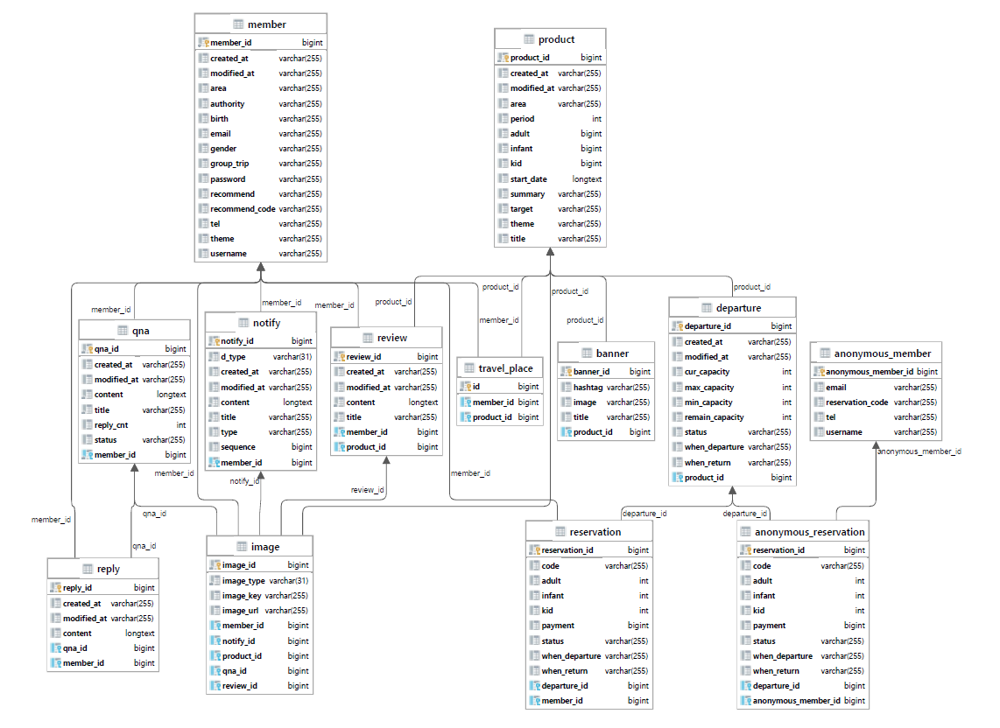

# 여행상품 사용자, 관리자 API 프로젝트 (기업연계 프로젝트)

<table>
  <tr style="text-align: center">
    <td colspan="3">당담 임무</td>
  </tr>
  <tr>
    <td>이민형</td>
    <td>회원관리, 서버관리, CI/CD, 상품관리, 배너관리, 리드미</td>
  </tr>
  <tr>
    <td>정성훈</td>
    <td>콘텐츠 관리, 예약 관리, 상품관리</td>
  </tr>
</table>

## ⚙ 프로젝트 개발 환경
- 통합개발환경 : Intellij
- JDK 버전 : JDK 11
- 스프링부트 버전 : 2.7.3
- 사용 DB : MySQL, Redis
- 빌드툴 : Gradle
- 관리툴 : Git, Github, Jenkins, Docker, AWS EC2, S3, RDS, ~~ElastiCache~~, ELB

## ⚒ 백엔드 기술 스택
- Backend
  - Spring Boot
  - Spring Security
  - Spring Validation
  - Spring Data Jpa
  - Spring Cloud Aws
  - Spring Devtools
  - Springfox (swagger)
  - Spring Boot Mail
  - QueryDsl
  - Gson
  - Lombok
  - JWT

- Database
  - MySQL 8.0.28
  - Redis 6.2.6
  
 

## 📜 프로젝트 구현 기능
- 회원 (Member)
  - 관리자페이지 : 관리자 로그인, 회원등급 변경, 회원 탈퇴
  - 사용자페이지 : 회원가입/로그인 및 로그아웃, 회원탈퇴, 아이디/비밀번호 찾기, 이메일 인증
- 상품 (Product)
  - 관리자페이지 : 전체상품 조회, 상품 상세조회, **상품등록**, **상품수정**, **상품삭제**
  - 사용자페이지 : 전체상품 조회, 상품 상세조회, **상품검색**
- 배너 (Banner)
  - 관리자페이지 : 전체배너 조회, 배너 상세조회, **배너등록**, **배너수정**, **배너삭제**
  - 사용자페이지 : 전체배너 조회, 배너 상세조회
- 콘텐츠 (Notify)
  - 관리자페이지 : 전체 공지사항 조회, 공지사항 상세조회, 공지사항 등록, 전체 자료실 조회, 자료실 상세조회, 자료실 등록, 공지사항/자료실 수정, 공지사항/자료실 삭제 
  - 사용자페이지 : 전체 공지사항 조회, 공지사항 상세조회, 전체 자료실 조회, 자료실 상세조회
- 예약 (Reservation)
  - 사용자페이지 : 예약목록 보기, 예약 추가, 예약 취소

## 📂 프로젝트 DB 모델링

  
> member : 회원 정보 테이블  
> product : 여행상품 정보 테이블  
> reservation : 상품 예약 테이블  
> departure : 상품 예약일 관련 테이블  
> banner : 메인페이지 배너 정보 테이블  
> travel-place : 여행했던 상품 테이블  
> review : 여행상품 후기 테이블  
> image : 이미지 테이블  
> notify : 공지사항 정보 테이블  
> qna : 1:1문의 테이블
> reply: 댓글 테이블  
> annonymous_reservation : 비로그인 유저 상품예약 테이블  
> annonymous_member : 비로그인 유저 정보 테이블

## 📜 프로젝트 API 명세서

>굵은 글씨는 리펙토링 해야 할 API

### 사용자페이지
|Function|Method|End Point|Token|
|---|---|---|:---:|
|회원가입|POST|/register|X|
|로그인|POST|/login|X|
|**아이디찾기**|POST|/find_email|X|
|**비밀번호찾기**|POST|/find_password|X|
|이메일 인증번호 받기|POST|/verify|X|
|이메일 인증하기|GET|/verify/{email}/{key}|X|
|사용자 정보 받아오기|GET|/user/me|O|
|사용자 정보 수정하기|PUT|/user|O|
|회원 탈퇴하기|DELETE|/user|O|
|상품목록 받아오기|GET|/products|X|
|상품 상세보기|GET|/product/{productId}|X|
|**상품 검색**|POST|/product?productName={productName}|X|
|배너목록 받아오기|GET|/banners|X|
|배너 상세보기|GET|/banner/{bannerId}|X|
|상품 예약일 목록 보기|GET|/product/{productId}/departure|X|
|예약일 상세보기|GET|/departure/{departureId}|X|
|상품 예약 목록 보기|GET|/reservation|X|
|상품 예약하기|POST|/reservation/{departureId}|O|
|상품 예약 취소 요청하기|PATCH|/reservation/{reservationId}|O|
|리뷰 전체보기|GET|/review|X|
|리뷰 작성하기|POST|/review/{productId}|O|
|리뷰 상세보기|GET|/review/{reviewId}|X|
|리뷰 수정하기|PUT|/review/{reviewId}|O|
|리뷰 삭제하기|DELETE|/review/{reviewId}|O|
|공지사항 목록 보기|GET|/notify/notice|X|
|공지사항 상세 보기|GET|/notify/notice/{notifyId}|X|
|자료실 목록 보기|GET|/notify/ref-library|X|
|자료실 상세 보기|GET|/notify/ref-library/{notifyId}|X|
|1:1문의 목록 보기|GET|/qna|O|
|1:1문의 하기|POST|/qna|O|
|1:1문의 상세 보기|GET|/qna/{qnaId}|O|
|1:1문의 수정하기|PUT|/qna/{qnaId}|O|
|1:1문의 삭제하기|DELETE|/qna/{qnaId}|O|
|1:1문의 댓글달기|POST|/qna/{qnaId}/reply|O|
|**1:1문의 댓글 수정하기**|PUT|/qna/{qnaId}/reply/{replyId}|O|
|**1:1문의 댓글 삭제하기**|DELETE|/qna/{qnaId}/reply/{replyId}|O|
|비회원 예약하기|POST|/anonymous/{departureId}|X|
|비회원 예약 조회|GET|/anonymous/{reservationCode}|X|
|**비회원 예약 취소 요청하기**|PATCH|/anonymous/{reservationCode}|O|

### 관리자페이지
|Function|Method|End Point|Token|
|---|---|---|:---:|
|어드민 로그인하기|POST|/admin/login|X|
|사용자 목록 보기|GET|/admin/members|O|
|사용자 권한 변경|PUT|/admin/member/{id}|O|
|사용자 탈퇴|DELETE|/admin/member/{id}|O|
|배너목록 받아오기|GET|/admin/banners|O|
|배너 상세보기|GET|/admin/banner/{bannerId}|O|
|배너 불러오기|GET|/admin/banner/load|O|
|**배너 등록하기**|POST|/admin/banner|O|
|**배너 수정하기**|PUT|/admin/banner|O|
|**배너 삭제하기**|DELETE|/admin/banner|O|
|상품목록 받아오기|GET|/admin/products|O|
|상품 상세보기|GET|/admin/product/{productId}|O|
|상품 등록하기|POST|/admin/product|O|
|상품 불러오기|GET|/admin/product/load|O|
|**상품 등록하기**|POST|/admin/product|O|
|**상품 수정하기**|PUT|/admin/product|O|
|**상품 삭제하기**|DELETE|/admin/product|O|
|예약일 만들기|POST|/admin/departure|O|
|예약일 삭제하기|DELETE|/admin/departure/{departureId}|O|
|공지사항 목록 보기|GET|/admin/notify/notice|O|
|공지사항 작성하기|POST|/admin/notify/notice|O|
|공지사항 상세보기|GET|/admin/notify/notice/{notifyId}|O|
|자료실 목록 보기|GET|/admin/notify/ref_library|O|
|자료실 작성하기|POST|/admin/notify/ref-library|O|
|자료실 상세보기|GET|/admin/notify/ref-library/{notifyId}|O|
|공지사항/자료실 글 수정|PUT|/admin/notify/{notifyId}|O|
|공지사항/자료실 글 삭제|DELETE|/admin/notify/{notifyId}|O|

## 개선해야할점 & 추후 리펙토링 예정
- API URL 설계
  - URL 에는 케밥케이스를 사용하자
  - PathVariable 에는 카멜케이스를 사용하자
  - 전체를 조회하는 URL 에는 끝에 s 를 붙혀서 복수형으로 사용하자